<!-- Custom Starry Sky Header Banner -->

  

  
  
  

---

## 👨‍💻 About Me

- 🔭 **Working on**: Enterprise web application development, Web APIs, and backend automation.
- 💼 **Experience**: 4+ years of professional software development experience.
- 🌱 **Learning & Improving**: Advanced DevOps pipelines, Docker containerization, and modern cloud architecture.
- 🎓 **Education**: Bachelor of Information Technology (BIT).
- ⚡ **Outside of Coding**: Strength training & fitness, solo motorcycle touring, and minimalist design.

---

## 🛠️ Tech Stack & Tools

### 🌐 Frameworks & Web Architecture

### 💻 Languages & Frontend

### 🗄️ Databases

### ⚙️ DevOps, Version Control & Tools

---

## 🧠 Focus & Discipline

<!-- GitHub Raw CDN hosted Anime Coding GIF -->

 

<i>"Consistency, focus, and continuous growth."</i>

---

*“Simplicity is prerequisite for reliability.”* — Edsger W. Dijkstra

